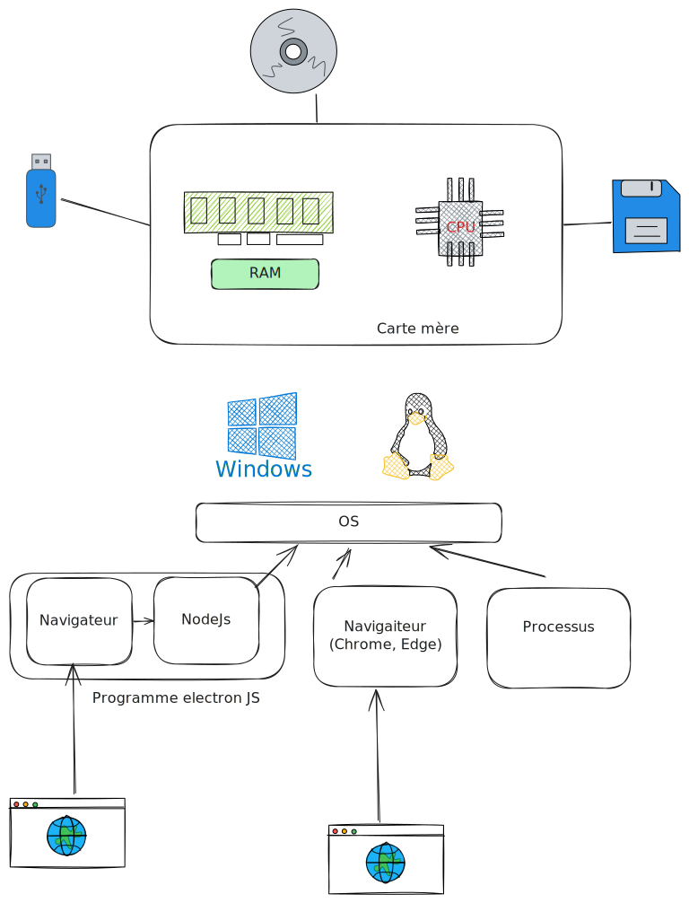

## Vision globale d'ElectonJS

## Création d'un projet avec Electron Forge

- Electron forge est un outil qui permet de simplifier les différentes actions qu'on souhaite faire sur un projet electron: démarrer un serveur de dev, générer une exécutable, etc.
  - [Documentation et guide Electron Forge](https://www.electronforge.io/)
- Electron Forge propose aussi la création d'un projet à partir d'un modèle.
- Création d'un modèle avec vite et TS `npm init electron-app@latest my-app -- --template=vite-typescript`

{}
Ce sont tous les deux des [bundlers](https://dev.to/sayanide/the-what-why-and-how-of-javascript-bundlers-4po9) JS. Ils permettent ainsi de regrouper un projet JS contenant plusieurs fichiers (code, images, etc.) en un ensemble de fichiers réduit et plus optimisé.

Webpack est sorti avant Vite et Vite se démarque de Webpack par sa **rapidité**.
Vite est créé par Evan You, le créateur de Vue.js
{}
